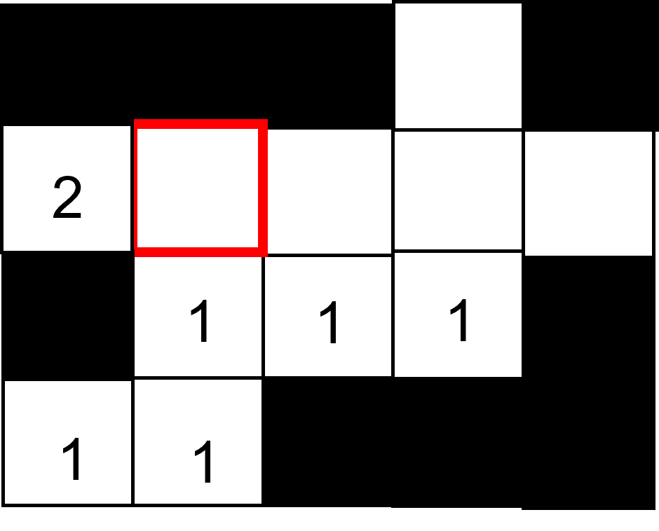
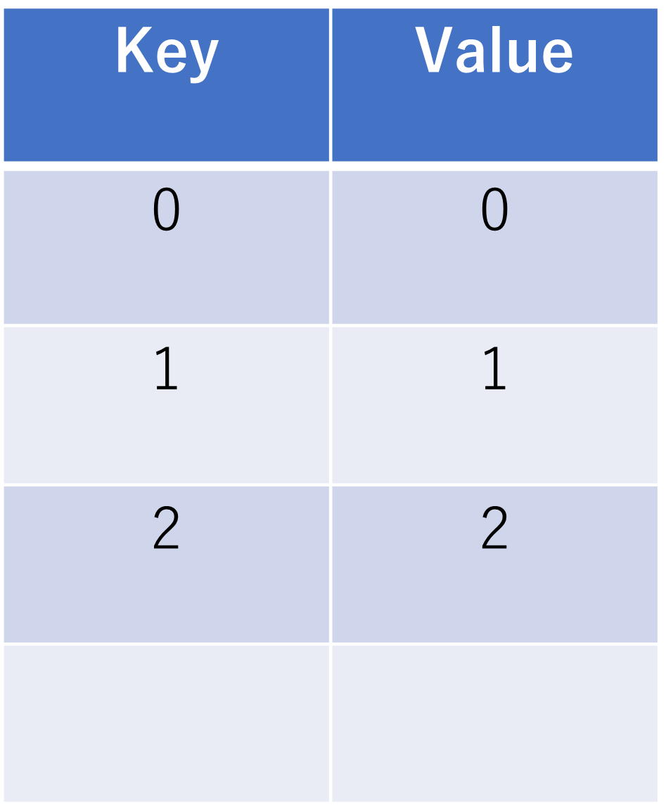
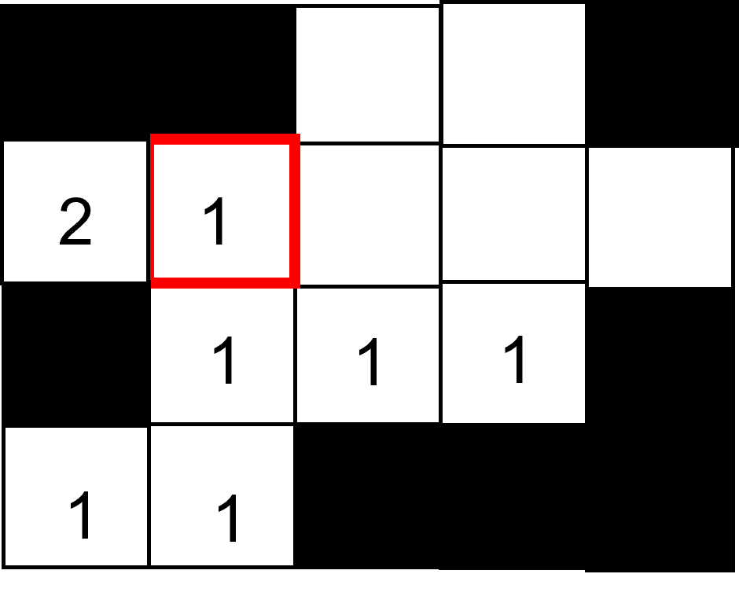
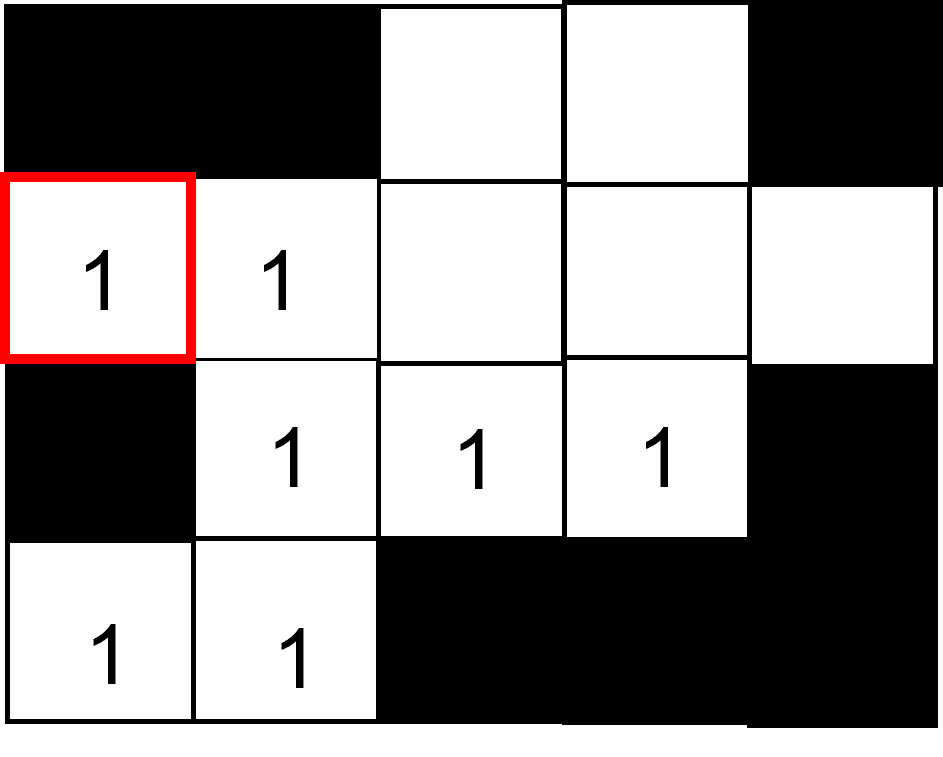
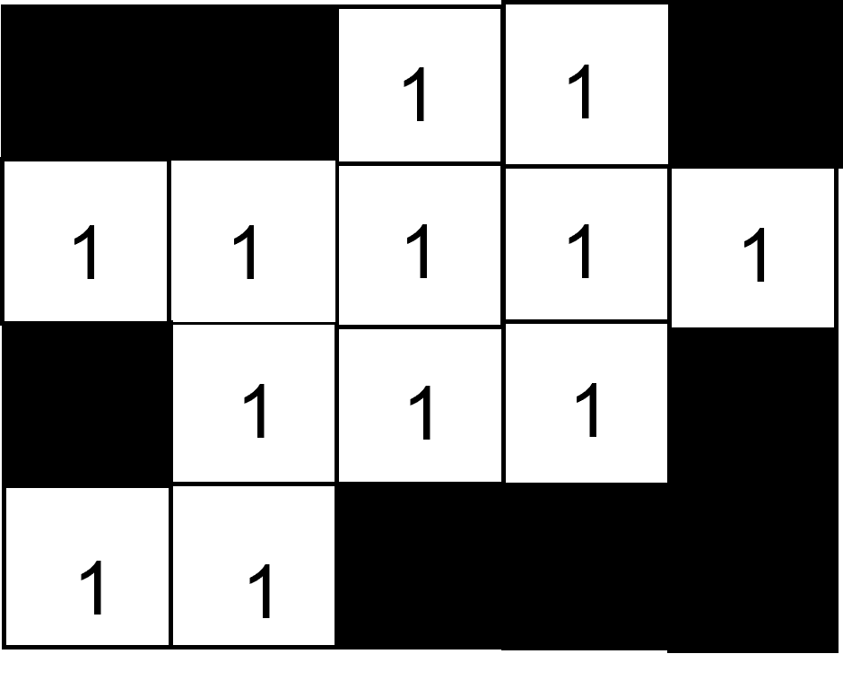
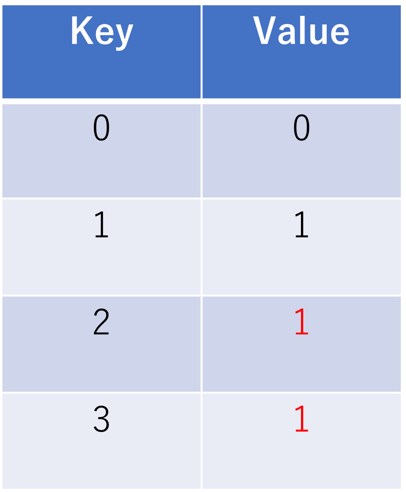
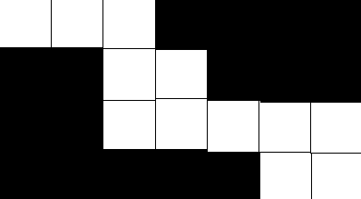
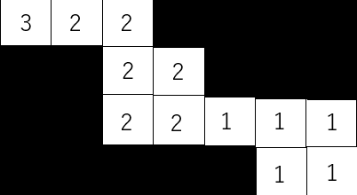
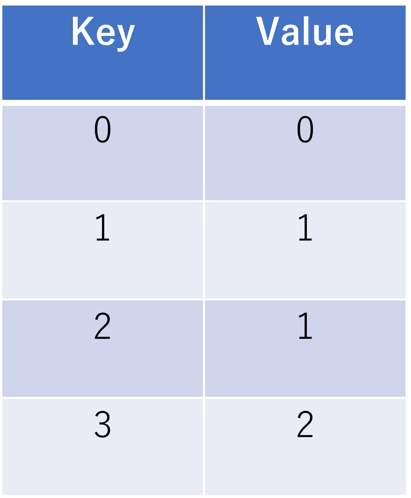

# B3プログラミングゼミ 第3回

今回実施する内容は以下の通りです。

* ラベリング・領域解析
* アフィン変換

実装の際は以下のようなことを考えてみてください。(ひょっとしたら考察のネタになるかも...)

- ラベリングはどのような点が便利か
- パターン認識で作成したラベリングと何が違うのか、どのような利点が考えられるか
- アフィン変換と射影変換はどのような点が違うのか、どちらがより使いやすいか
- 画像の補間はなぜ必要なのか

## ラベリング・領域解析

### ラベリング

**ラベリング**は同じ連結成分を構成する画素に対して同じ番号をつけ、領域の区別を行なうための処理です。

### 領域解析 

連結成分は形状の特徴を用いて分類することができます。以下に、研究等でよく使用されるパラメータの例を示します。

* 面積 : 同一領域内の画素数
* 重心 : 各画素の重さが等しいと仮定したときの領域の重さの中心
    
    
    $x_g = \frac{\sum x}{S} \ \ \ \ \ \ \ \ \ \ -(1)$ 
    
    $y_g = \frac{\sum y}{S} \ \ \ \ \ \ \ \ \ \ \ - (2)$
     
    
* 周辺長 : 領域の周辺の長さ
* 円形度 : 領域がどれだけ円に近いかを表す尺度。面積をS、周囲長をLとしたとき、以下の式で表される。対象が円の時、円経度は最大値1となる。
    
    $\frac{4\pi S}{L^2} \ \ \ \ \ \ \ \ \ - (3)$

### アルゴリズム

今回のゼミで作成したラベリングのアルゴリズムについて説明します。このアルゴリズムは[こちら](https://qiita.com/IcchI1/items/102fec377f63c6c03d79)のサイトで示されたアルゴリズムを改良したものとなっています。

### a. ラベル値決定
注目画素がラベリング対象であるとき、注目画素の隣接8近傍における下の画素と左の画素のみ(計2つ)に着目すると、この2つの隣接画素には以下の4パターンが考えられます。

1. どちらも領域でない場合
2. 左側の画素にラベリングがされている && 下側の画素は領域でない
3. 左側の画素は領域でない && 下側の画素にラベリングがされている
4. どちらもラベリングされている

このとき、パターンに応じて以下のように処理を分岐します。

1.のとき、注目画素は新しくラベリングが必要な領域であるため、新しいラベルを付与

2.のとき、注目画素は左側の画素の連結成分であるため、左のラベルを注目画素に付与

3.のとき、注目画素は下側の画素の連結成分であるため、下のラベルを注目画素に付与

4.のとき、左のラベルと下のラベルを比べると下のほうが古いラベルであるため、下のラベルで注目画素を更新

このような処理分岐で、注目画素には常に新しいラベル or 連結したラベルが付与することができます。

### b. ラベル管理

ラベルの管理にはハッシュテーブルを利用します。ラベル衝突が発生する際に**左ラベルをキーとするハッシュ値を下ラベルの値に更新する**ことで、ラベル値を実質的に同じものにする、という処理を施しています。

a. b. ２つの説明をまとめたものを処理フローでチェックしましょう。

図2のような状態のとき、赤枠ではラベルの衝突が発生します。

    

図2 左: ラベリング領域  右: ハッシュテーブル

注目画素値の決定がされ、アルゴリズムどおり注目画素にはラベル1が付与されます。そして、不要になった左ラベルも下ラベルの数値である1に更新されます。

ここで、同じタイミングで同時にハッシュテーブルの更新を行ないます。左のラベルがキーとなるハッシュ値を下のラベルの値に更新します(図3)。

  

図3 左: ラベルを付与  右: 更新されたハッシュテーブル

左側のラベルは不要になり、かつ隣接しているラベルに合わせる必要があるので下ラベルに更新する必要があります。

 

図4 左: 左ラベルの更新 

以降も同様にラベリングを繰り返すと、最終的に図4のような結果となります。

 

図4 左: ラベリング結果  右: 最終のハッシュテーブル

このようにして、画像における領域のラベリングを再帰処理を使わずに行なうことができます。

ハッシュテーブルを利用すると、以下のような状況に対処できます。
図5の左領域をについて上記のままでラベリングすると、結果は右のようになりうまくいきません。

  

図5: ラベリングがうまくいかない例

ここでハッシュテーブルが活躍します。図5の状況のハッシュテーブルが図6です。キーが3のときハッシュ値が2、キーが2のときハッシュ値が1となっています。

 

図6: 図5のハッシュテーブル

今回使用するアルゴリズムの場合、キーとハッシュ値が不一致の際にはそのハッシュ値を再びキーとしてハッシュ値探索を繰り返すことで、必ずキーとハッシュ値が一致する地点まで帰ることができます。その特性を利用し、キーとハッシュが一致する地点までハッシュテーブルを探索する処理をあらかじめ行なうことで、ラベル上では値は異なっていてもハッシュテーブル上では一致している、というラベリングが行なえます。

もちろん、最後にはハッシュテーブルを参考にラベルを塗り替えればすべてのラベルを統一することができます。

これがハッシュテーブルを使う重要な目的です。

## アフィン変換

幾何学変換処理の中でもアフィン変換は非常に単純な処理に分類されます。拡大や縮小、回転、せん断、平行移動が行える変換手法であり、**任意の平行四辺形を別の平行四辺形へと変換**できる手法です。

任意の画像における画素$(x,y)$を$(x',y')$に変換するアフィン変換は以下の行列式で示されます。

$
\begin{pmatrix}
x' \\ 
y' \\ 
1 
\end{pmatrix} = \begin{pmatrix}
a & b & c \\ 
d & e & f \\ 
0 & 0 & 1
\end{pmatrix}
\begin{pmatrix}
x \\ 
y \\ 
1 
\end{pmatrix}
$

上記式の行列式を変形したものが式(1)と式(2)です。

$x' = ax + by + c \ \ \ \ \ \ \ \ -(1)$

$y' = dx + ey + f \ \ \ \ \ \ \ \ -(2)$

上記において、$a ～ f$ はそれぞれ変換に関わるパラメータです。表に示すパラメータの組み合わせによって上に示した各種変形が実現されます。

| 　　　　　　　変換 | 　$a$ |　$ b $ |　$c$ | 　$d$ | 　$e$ | 　$f$ |
|:---:|:---:|:---:|:---:|:---:|:---:|:---:|
|拡大・縮小(横 0.75倍、縦 1.5倍)|0.75|0|0|0|1.5|0|
|回転(半時計回り45°)|$cos45°$|$-sin45°$|0|$sin45°$|$cos45°$|0|
|鏡映($x$軸対象)|1|0|0|0|-1|0|
|鏡映( $y = x$ 対称)|0|1|0|1|0|0|
|平行移動($x$軸方向に100、$y$軸方向に-100)|1|0|100|0|1|-100|

## 射影変換

実装難易度がやや高いので説明程度に留めますが、B4からの研究で必要となる方が多いのが**射影変換**です。

射影変換はアフィン変換より複雑な変形が可能であり、**任意の四角形を別の任意の四角形へと変換**できる、アフィン変換のすべてを包含した処理です。

任意の画像における画素$(x,y)$を$(x',y')$に変換する射影変換は以下の形で示されます。

$
x' = \frac{ h_{11} x + h_{12} y + h_{13} }{ h_{31} x + h_{32} y + h_{31} },
$
$
y' = \frac{ h_{21} x + h_{22} y + h_{23} }{ h_{31} x + h_{32} y + h_{31} }
$

上記式における $h_i$ は射影変換に必要なパラメータです。

詳しくは参考書『ディジタル画像処理[改訂第2版]』p.180 ~ p.181を参考にしてください。

## 画素の補間について
各種の幾何学変換を行なった際、出力画像のすべての画素について、元となる入力画像の画素が存在するわけではありません。

例として、画像を2倍に拡大する変換を考えます。図1には入力画像$( 5 × 5 )$と拡大画像$( 10 × 10 )$が示されています。このとき、拡大画像には欠落する画素が必ず発生するします。

これを回避するため、通常は**補間処理**が変換と同タイミングで行なわれます。

補間処理には二アレストネイバー、バイリニア補間、バイキュービック補間などが挙げられます。

    

図１　画像拡大(左 : 入力画像、右 : 拡大画像)

## 実装課題

今回はラベリングプログラムの処理作成と、アフィン変換のカラー画像対応を実装してもらいます。

領域削除ついては`labeling.bmp`を利用し、面積の小さい図形2つを削除した画像1枚を出力してください。

画像補間については`lenna.bmp`を利用し、3チャンネル画像を引数に取れる処理に変更してください。

処理を実装するファイルは以下の通りです。

- `myImage.hpp`：ヘッダファイル
   - クラスの定義
   - 関数のプロトタイプ宣言
- `labeling.cpp`：RGBとHSLの相互変換を行なうソースファイル
- `affine.cpp` : アフィン変換を行なうソースファイル
- `labeling.cpp`: ラベリング周りの処理を行なうソースファイル  
- `main.cpp`：`main`関数が記述されているソースファイル

自分で新しくファイルを作成する、処理を追加する等は問題ありません。想定された処理が実装できる範囲内で、より良い処理を実装してみてください。

### 実装のポイント

- アフィン変換プログラムだけでなく、画像補間プログラムも3チャンネル対応処理にしないと出力結果が想定外のものとなるので気をつけてください。

- visualize_labeled_result()を利用すると、出力結果が同じ数値でラベリングできているかを画像で色覚的に確認することができます。

