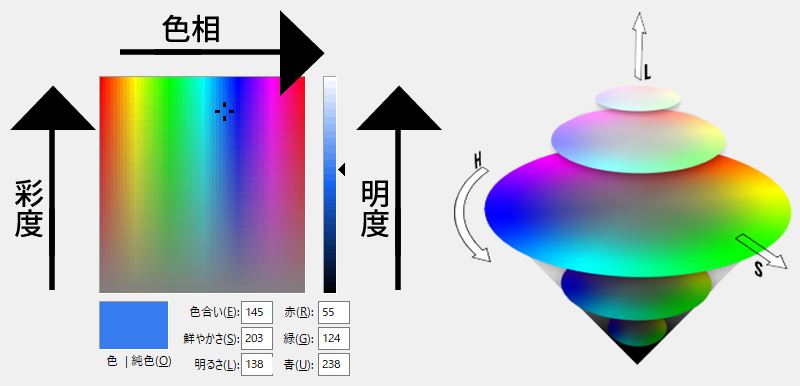

# B3プログラミングゼミ 第4回

今回実施する内容は以下の通りです。

* 色空間、表色系
* HSL変換

実装の際は以下のようなことを考えてみてください。(ひょっとしたら考察のネタになるかも...)

- 色相角の定義域はどこからどこまでであるか
- 
- 
- 

##  色空間と表色系
<span style="color: red">R</span><span style="color: green">G</span><span style="color: blue">B</span>(赤、緑、青)の3色は、光の3つの基本的な成分を表すカラーモデルです。RGBモデルは、コンピュータグラフィックスやディスプレイ技術に非常に適していますが、それぞれの色が直線的に組み合わさるため、人間の視覚に基づいた色再現には制約があります。人間の視覚は、RGBの三成分だけで完全に説明できないほど複雑です。

人間の視覚システムは、RGBでは表現しきれない色差や色の感知特性を持っています。特に、人間の視覚はL錐体(赤錐体)、M錐体(緑錐体)、S錐体(青錐体)の3つの錐体細胞からの出力信号を受け取っており、これらの錐体細胞の感受性は一般的なRGBモデルとは異なると考えられています。したがって、特定の色を正確に再現するためには、RGBモデルだけでは不十分なのです。

色を定量的に表す体系には**表色系**と**色空間**があります。いくつか代表例を示します。


* **CIE-RGB表色系** - Red、Green、Blueを使って加法混色で色を作成。ディスプレイ等の光を利用する装置で利用
* **マンセル表色系** - Hue(色相)、Saturation(彩度)、Lightness(輝度)を使って人間の知覚に似た方法で色を作成
* __L* a* b*色空間__ - 人間の感覚に近い均質な色空間で色を作成、画像から特定の色を抽出するときに利用


今回のゼミでは、表色系の中でもマンセル表色系(以下、HSLモデル)について扱います。

HSLモデルでは色を次の3要素で構成し、表現します。

* **色相(Hue)** - 色の違いを示す属性
* **彩度(Saturation)** - 色の鮮やかさを示す属性
* **明度(Lightness)** - 明るさを示す属性

<div style="text-align: center;">

図1 マンセル表色系
</div>

### 色相(Hue)

色相は、特定の色が「赤」「青」「緑」「黄色」など、色の種類や種類の区別を表す性質です。色相は、色の見た目における基本的な特性であり、色の本質的な性格を示します。

色相は通常、色のスペクトル上の位置で表現され、円環状になります。これは、色相が連続的で循環的であることを示しています。一般的な色相環では、0°(または360°)が赤色を示し、60°が黄色、120°が緑、180°がシアン(青緑)、240°が青、300°がマゼンタ(赤紫)など、色相の基本的なカテゴリーが配置されています。

色相は以下の式で求めることができます。
```math
H = \left\{\begin{array}{ll}
undefined & (if \quad MAX = MIN) \\ \\
60^\circ \times \frac{G-B}{MAX-MIN}+0^\circ & (if \quad MAX = R \; and \;G \geqq B) \\ \\
60^\circ \times \frac{G-B}{MAX-MIN}+360^\circ & (if \quad MAX = R \: and \: G < B) \\ \\
60^\circ \times \frac{B-R}{MAX-MIN}+120^\circ & (if \quad MAX = G) \\ \\
60^\circ \times \frac{R-G}{MAX-MIN}+240^\circ & (if \quad MAX = B)
\end{array} \right.
```

### 彩度(Saturation)

彩度(Saturation)は、色の鮮やかさ、鮮度、色の純度、色の濃さを表す指標です。彩度が高い色は、より鮮やかで鮮度の高い色として知られ、彩度が低い色はより灰色や薄く、鮮やかさに欠ける色とされます。

彩度は、特定の色が白または灰色からどれだけ遠いか、または色がその純度を維持しているかを示します。高い彩度の色は、その色が "純粋" であると見なされ、色相が支配的であると感じられます。一方、低い彩度の色は、色相に比べて白または灰色が支配的で、より淡い、より灰色がかった外観を持つことがあります。

彩度は以下のような計算式で求めることができます。
```math
S = \left\{ \begin{array}{ll}
0 & (if \quad L = 0 \; or \; MAX=MIN) \\ \\
\frac{MAX-MIN}{MAX+MIN} = \frac{MAX-MIN}{2L} & (if \quad 0 < L \leqq \frac{1}{2}) \\ \\
\frac{MAX-MIN}{2-(MAX+MIN)} = \frac{MAX-MIN}{2-2L} & (if \quad L > \frac{1}{2}) 
\end{array} \right.
```

### 明度(Lightness)

明度(Lightness)は、色の明るさまたは輝度を示す指標です。明度は、色がどれだけ明るいか、またはどれだけ暗いかを評価するために使用されます。色の明度は、色が白色または黒色からどれだけ遠いかを示します。

明度は以下のような計算式で求めることができます。
```math
L = \frac{MAX-MIN}{2} 
```


これらのパラメータを個別に調整することで、RGBモデルだけでは操作が難しいような処理を簡単に行うことが可能となります。例えば、画像をより明るくしたい場合について、RGBモデルだけの操作では明るさだけでなく濃度も同時にパラメータとして操作されてしまいますが、RGBモデルをHSLモデルに変換、HSLモデルのパラメータ調整、HSLモデルを再びRGBモデルに戻すことで、明るさだけを任意に調節することが可能です。


##  実装課題

今回は入力されたRGB画像をHSL画像に変換する処理を実装してもらいます。

`img`ファイル内にある`lenna.bmp`をHSL画像に変換し、それぞれH、S、Lの1チャンネルずつに分離した画像1枚ずつ、計4枚を作成してください。

なお、Hチャンネルの画像については、色相を30度回転させた画像とします。

処理を実装するファイルは以下の通りです。

- `myImage.hpp`：ヘッダファイル
   - クラスの定義
   - 関数のプロトタイプ宣言
- `hls.cpp`：RGBとHSLの相互変換を行なうソースファイル
- `main.cpp`：`main`関数が記述されているソースファイル

自分で新しくファイルを作成する、処理を追加する等は問題ありません。想定された処理が実装できる範囲内で、より良い処理を実装してみてください。


### 実装のポイント
* 一般に、RGB画像はチャンネルの並びがB、G、Rの順、HSL画像はチャンネルの並びがH、L、Sの順に並んでいるので注意してください。

* 色相に関しての実装がやや難しいと思います。参考書『ディジタル画像処理[改訂第2版]』p.79 ~ p.81も参考にしてみてください。

* クラスのメンバ関数にはゲッタ(`getPixel()`)とセッタ(`setPixel()`)が実装されています。これらを利用するとindexを書かずに画素値を扱うことができます。

* `color_convert.cpp`内にある`split_Channel()`で、チャンネルごとに値を分離することができます。

* デバッグのためにOpenCVでの答え合わせをすることは問題ありません。ですが、OpenCVで作成した画像を提出するのはゼミの趣旨から逸脱しているので止めましょう。
