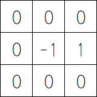
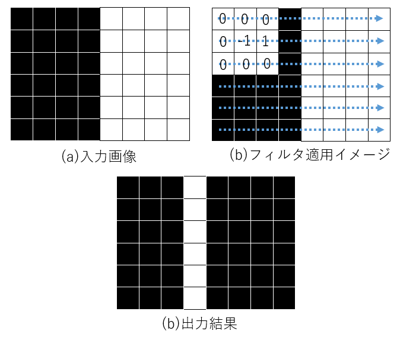

# B3プログラミングゼミ 第5回

今回実施する内容は以下の通りです。

* **エッジ抽出**

実装の際は以下のようなことを考えてみてください。(ひょっとしたら考察のネタになるかも...)

- エッジとはそもそも何か
- エッジ強度、エッジ角度はそれぞれどのようなパラメータか
- エッジを抽出するためのフィルタにはどのようなものがあげられるか
- エッジをよりキレイに抽出するためにはどのような前処理が必要か

## エッジ抽出

画像処理において、**エッジ**とは画素値が急激に変化している部分を示すものです。画素の変化は画像中の対象を分割する境界を示すため、画像の特徴解析手法の1つとしてよく用いられています。

エッジ抽出処理は隣接画素間の差分をとることで行ないます。この処理手順から、エッジ抽出は**画像に対する微分**であると考えることができます。図2では、図1のフィルタを適用した例が示されています。エッジ抽出は平滑化処理と似ており、図2(b)に示すように**フィルタ**を画像に掛けることが一般的な処理です。

  図1 横微分フィルタ

  

  図2 微分フィルタ適用例

エッジ抽出に用いるフィルタはさまざまなものがあります。フィルタの内容やその処理結果は参考書『ディジタル画像処理[改訂第2版]』p.109 ~ p.116に記載されているので、確認してみてください。

### エッジ強度

エッジ強度とは、画像中の注目物体とそうでない部分を分ける境界(輪郭)が、どれだけはっきりと表れているかを示す指標です。

エッジ強度は以下の式で表されます。

$S = \sqrt{dx^2 + dy^2}$

### エッジ角度

エッジ角度とは、エッジが示す勾配の方向を表す指標です。以下の式で表されます。

$\theta = tan^{-1} \frac{dy}{dx}$

## 実装課題

今回は、入力画像に対して微分フィルタをかけてエッジを検出する処理を実装してもらいます。

`edge.cpp`のの穴埋めをして、画像にフィルタをかけてみます。

`img`ファイル内にある`lenna.bmp`からエッジ強度とエッジ角度を計算し、1チャンネル画像としてそれぞれ1枚ずつ(エッジ強度画像、エッジ角度画像)、計4枚作成してください。

処理を実装するファイルは以下の通りです。

- `myImage.hpp`：ヘッダファイル
   - クラスの定義
   - 関数のプロトタイプ宣言
- `edge.cpp`：入力画像からエッジ強度、エッジ角度の値を求める処理を行なうソースファイル
- `main.cpp`：`main`関数が記述されているソースファイル

自分で新しくファイルを作成する、処理を追加する等は問題ありません。想定された処理が実装できる範囲内で、より良い処理を目指してください。

### 実装のポイント

- フィルタには様々な種類があります。いろいろ試して各フィルタの特徴を掴んでみましょう。
- 計算したエッジ角度、エッジ強度を画素値の0~255の範囲に収めるための処理を忘れないように。

