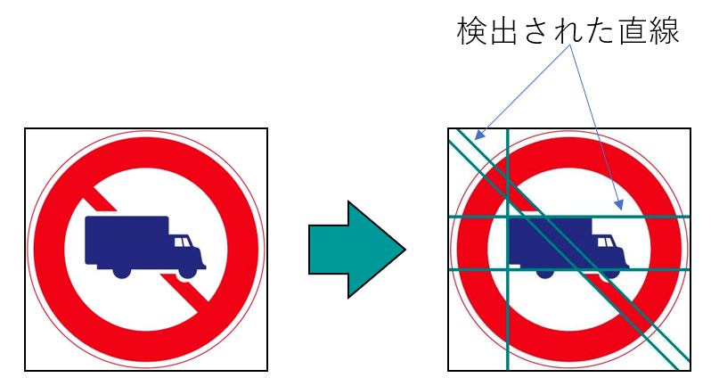
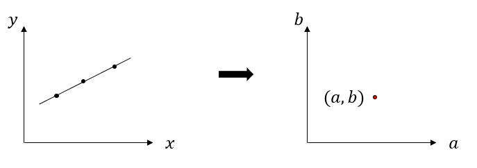
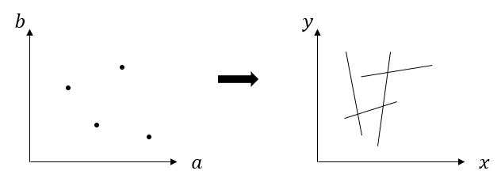
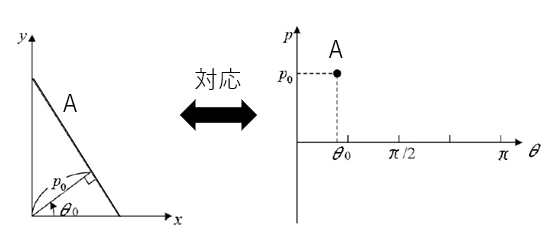
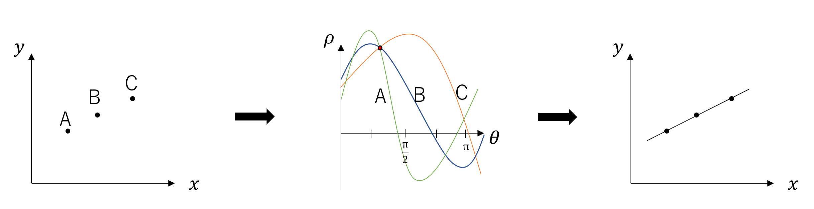
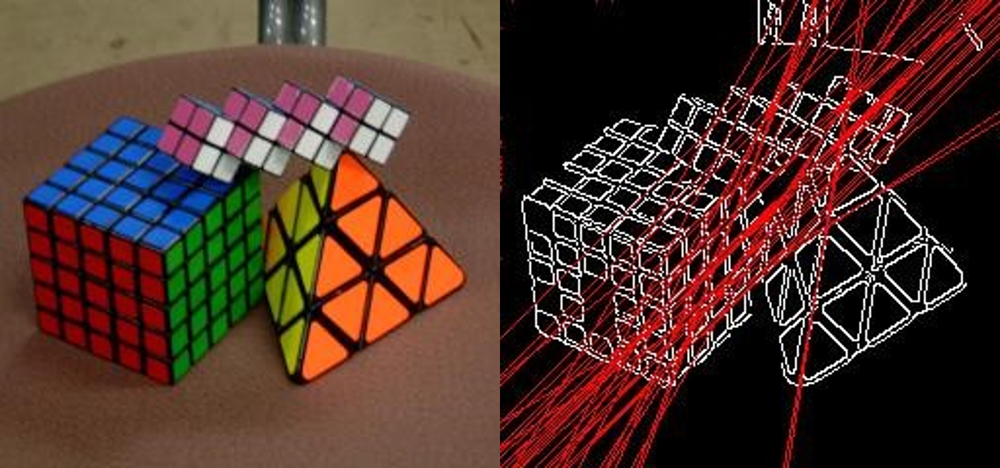
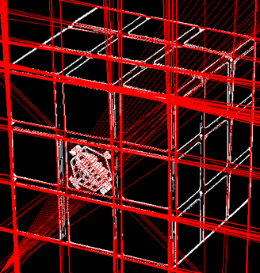

# B4プログラミングゼミ 第6回

## 今回の課題
* Hough変換(直線検出)

実装の際は以下のようなことを考えてみてください。(ひょっとしたら考察のネタになるかも...)

- Hough変換の原理はどのようなものか
- 直線が検出されやすくするためにはどうすればいいか
- 直線の決定式は最適であるか、問題点はあるのか

##  Hough変換

**Hough変換** は、画像中の特定の形状やパターンを検出および識別するために使用される画像処理技術の1つです。主に直線や円などの幾何学的な形状を検出するために使用します。

図1 Hough変換

###  Hough変換の原理

$xy$画像空間中の直線は、 $a$ を傾き、 $b$ を切片とした時、(1)式で表すことができます。

$y = ax + b \ \ \ \ \ \ \ \ \ \ \ \ \ \ \ \ \  - (1)$

傾きと $y$ 切片との2つのパラメータで直線を表現できるため、これらのパラメータを座標軸にした空間( $ab$パラメータ空間 )では、 $xy$ 画像空間中のある直線を1点で表すことができます(図2)。

図2 $xy$画像空間と $ab$ パラメータ空間の関係

一方で、 $xy$ 画像空間中の直線を $l$ としたとき、直線 $l$ 上の点( $x_i$ , $y_i$ )は、(2)式で $ab$ パラメータ空間に写像されます。

$b = -x_i a + y_i \ \ \ \ \ \ \ \ \ \ \ \ \ \ \ \ \  - (2)$

 $xy$ 画像空間中の点は、 $ab$ パラメータ空間では傾き $-x_i$ と $b$ 切片 $y_i$ の直線で表すことができるため、直線 $l$ 上の複数の点を $ab$ パラメータ空間に写像すると、点の数だけ直線を描くことができます。これらの直線は $ab$ パラメータ空間内の1点 $(a, b)$ で交差します。

つまり、この交差する点の座標を検出すれば、 $xy$ 画像空間中の直線を決定することができるのです。

図3 $ab$空間上の点と $xy$ 画像空間中の直線

### 実際に使用する式について
直線式(1)は、パラメータ $a, b$ の取り得る値域が $- \infty \sim + \infty$ となることが考えられます。そのため、パラメータ空間の大きさを制限するために、実際には三角関数を用いた(3)の式を使うのが一般的です。

$\rho = x cos \theta + y sin \theta \ \ \ \ \ \ \ - (3)$

このとき、 $\rho$ は原点から直線までの符号付き距離、 $\theta$ は原点から直線への垂角 $(0 \leqq \theta < \pi)$ を表しています (図3を参照)。

図4 点と $ρ,θ$ の関係

 $xy$ 画像平面中の点 $(x_i, y_i)$ を通る可能性のある直線を検出するため、 $ρθ$ 空間では投票処理が行なわれます。 $xy$ 空間全体の画素それぞれについて投票処理の対象としていくと、直線が存在する可能性の高いパラメータ $(ρ,θ)$ には投票がより多く集まっていきます。集まった票がしきい値を超えた点について、パラメータ $(\rho, \theta)$ を(3)式に代入することで、 $xy$ 画像空間中の直線を導出することができます。

例として、図4左の状態から点 $A$ 、点 $B$ 、点 $C$ が直線 $l$ 上にあることを検出してみます。それぞれの点を式(3)に代入し、 $\theta$ のパラメータを動かすことで、図5真ん中のように、 $\rho  \theta$パラメータ空間には正弦波が写像されます。これら正弦波上すべての点に対して投票処理を行なうと、正弦波が重なりあう点については複数の票が集まることになります。その点の座標こそが、点 $A$ 、点 $B$ 、点 $C$ を線上に持つような直線 $l$ のパラメータとなります。

図5 投票と検出のイメージ

実際に画像にHough変換を適用した例を図6に示します。

図6 Hough変換処理の実装前と実装後

## 実装課題
今回の実装課題は2つあります．配布したコードの該当部にコードの追加・書き換えを行なってください．

(1) 現在のコードでは直線の描画処理を一次関数の一般式 $y = ax + b$ の形を用いて実装しています．しかし，この式は $a$ の値が極端に大きくなった際の描画に向いていないという問題点があります．

そこでその問題を解決するため，直線の描画を媒介変数を用いた式に書き換え，その出力が直線を検出していることを確認してください．

図7 直線が複数検出される例

(2) 配布されたコードをそのまま実装すると，図7のように1本の直線に対して検出を示す赤い線が何本も出力されていることが確認できます．

原因は主に2つです．

- 投票値のしきい値処理が甘いため
- エッジ検出した際，エッジが太く出ている．

今回の実装では前者の投票処理について改良していただき，検出数を絞ってもらいます．

## 今後の予定
* **今回** ー Hough変換の説明。次回までにプログラム(最低ライン : 直線検出ができるまで)を完成させる
  * この時点では精度上げはまだしなくていい(先にやりたい人はやってもOK)

* **次回** ー 直線検出が完成しなかった人の補助 + 補足説明(精度上げのヒント) + 質問

* **最終回** ー レジュメとスライドを作成し、佐治先生、M2、M1、B4の前で発表　

