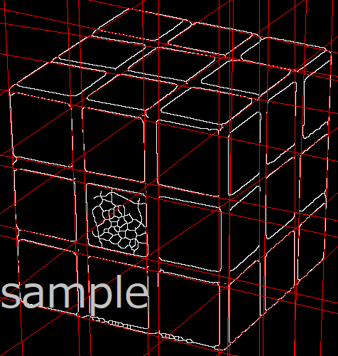
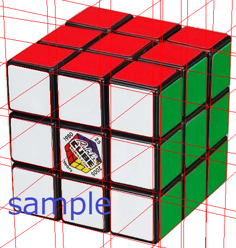
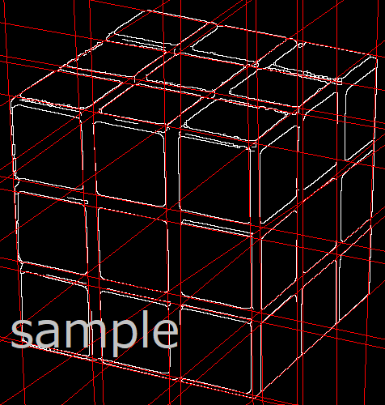

# B3プログラミングゼミ 最終回

## 最終課題
今回の課題がB3プログラミングゼミの最終回です．

### 課題説明

ゼミ第6回では，ルービックキューブの画像から直線を検出するプログラムの作成を行いました，しかし，実際には直線が1本にも関わらず複数の直線が検出されてしまう等の問題があります．

最終課題では，ルービックキューブから直線を精度良く検出する手法について考え，実装してもらいます．

具体的な考えとしては以下のような例があります．

- 画像内1つの直線に対し，直線が1本出力されるように改良する．

- 直線が本来検出されない箇所で検出されるから，検出が発生しないようにする．

- 直線が検出されていない箇所を検出する．

などなど．．．

他にも，画像の質に着目したり，キューブの色空間を変化させてみたり，いくらでも適用できる処理があります．自分なりに直線がきれいに検出されるよう研究してみてください．

この課題の結果を全体ゼミで発表し，B3プログラミングゼミは終わりになります．例として，過去の先輩が挑戦した結果画像を図1に示します．

  図1 直線の検出例(左，中央が同様の検出結果，右は中心ロゴをマスク処理したもの)

プログラムを作成・改造して動かしてみましょう．
結果を見て，何が原因で(上手くいった | 悪かった)かを考えてください．

## 発表について
発表はPowerPointに資料を作成して行います．

以下のような流れだと自然な発表例となると思います．参考にしてください．

- 考案した直線検出手法の全体概要
- 手法の具体的な内容を順に説明
- 結果画像
- 考察，うまくいったこと，うまくいかなかったこと等を書く

手法説明では，「◯◯な理由からこうした」，「△△と✕✕を比較し，こう考えられるからこっちにした」，といったように理由を踏まえて説明してください．

発表終了後に簡単な質疑応答タイムがある予定です．がんばれ！
